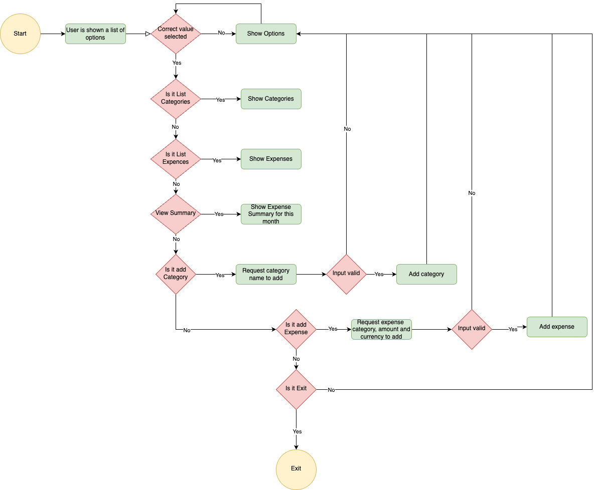

# Budeget Me

Budget me is a python terminal app,which runs in the Code Institute mock terminal on Heroku users can add expences to different categories and summerize their expences.

To do live link

## How to use

- Budget Me is simple expense tracker that allows users to add, list and summerize expences. Additionally users can add expense categories.
- In this version when the application is started user is given 5 options to select.
- Based on user's selection program will retrieve data from Google sheets or prompt user for input so that user can add expenses or categories

## Features

- List available options
  - Show available options to the user
  - Prompt for user's input
  - Validate the input allow user to continue if user
  - TODO add image
- List available expense cagegories
- Add a new expense category
  - User is allowed create a new category that does not exist in the list already
- List available expenses
- Add a new expense
  - User is prompted to enter required data
  - Data is validated, and indicates users about the error and provide instructions if data is invalid
  - Expense google sheet is updated if the data is correct
- View summary
  - User is able get a summary of expenses for the current month
  - TODO add image
- List options
  - User is able to list the options again
  - TODO
- Exit
  - Exits the application

## Future Features

- Get summary for a particular day or date range
- Support a valid list of currencies
- Ability to add income

## Planning

Created a plan on how to implement the project

- Use the google sheet as data the source and the data model.
- Create and setup a new worksheet for Expenses.
- Create and setup a new worksheet for categories.
- Use python to creat the project
- Use Github as a source code repository
- Deploy in heroku.

## Design

Wrote user stories and a flow chart to identify the usage of the software and what features to be given.

### User stories

- User gets a list options to choose when the program is run
- User can choose one of the options displayed
- User can add expenses with currency, category and amount
- User can add category with name
- User can list expenses
- User can list categories
- User can view the summary of expenses

## Testing

Tested by running the application locally and executing different scenarios defined by the user stories.

### Test Matrix

| Id  | Feature                   | Test case                                                                    | Expected outcome                                                | Result |
| --- | ------------------------- | ---------------------------------------------------------------------------- | --------------------------------------------------------------- | ------ |
| 1   | List available options    | When program is run show a list of available options                         | The list of available options are shown                         | PASS   |
| 2   | List available categories | User can choose list categories by typing in the selection in to the input   | The list of available categories are shown                      | PASS   |
| 3   | Add category              | User can choose Add category by typing in the selection in to the input      | User is prompted to input category name                         | PASS   |
| 4   | Add category              | User cannot add empty name                                                   | Display an error                                                | PASS   |
| 5   | List expenses             | User can choose list expense by typing in the selection in to the input      | The list of available expenses are shown                        | PASS   |
| 6   | Add expense               | User can choose Add expense and create an expense by providing correct input | User is prompted to input expense amount, category and currency | PASS   |
| 7   | Add expense               | User puts a category not listed in categories                                | User is given an error message and prompted to select an option | PASS   |
| 8   | View summary              | User select view summary option                                              | A summary of the expenses of the current month is shown         | PASS   |
| 9   | Exit                      | User select exit as the option                                               | Application exits                                               | PASS   |
| 10  | List options              | User select List options                                                     | Options list is shown again                                     | PASS   |
